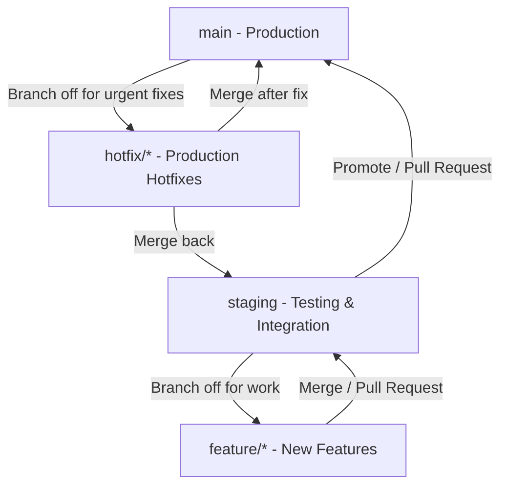

# Git Branching & Development Workflow

This document outlines the Git branching strategy and workflow conventions for this portfolio project. Following these guidelines ensures code quality, easy feature tracking, and smooth deployments.

---

## 1. Branching Model

We use a structured branch layout consisting of two permanent integration branches and temporary supporting branches.



### Permanent Branches
*   **`main`**: The production branch. It contains only stable, tested, and ready-to-run code.
    *   *No direct commits allowed.*
    *   Only receives merges from `staging` (for releases) or `hotfix/*` (for urgent production fixes).
*   **`staging`**: The pre-production and integration branch.
    *   New feature branches merge here first.
    *   Use this branch to preview, test, and verify features locally or on a staging server.

### Temporary Branches
*   **`feature/*`**: For building new features, screens, or components.
    *   Always branches off: `staging`.
    *   Merges back into: `staging`.
*   **`bugfix/*`**: For fixing issues found during testing.
    *   Always branches off: `staging`.
    *   Merges back into: `staging`.
*   **`hotfix/*`**: For urgent bug fixes needed directly in production.
    *   Always branches off: `main`.
    *   Merges back into: both `main` and `staging`.

---

## 2. Naming Conventions

Always name your branches using lowercase letters and hyphens to separate words. Use the appropriate prefix:

| Branch Type | Prefix | Example | Description |
| :--- | :--- | :--- | :--- |
| **Feature** | `feature/` | `feature/github-sync-api` | Adding new features or enhancements |
| **Bug Fix** | `bugfix/` | `bugfix/contact-form-validation` | Resolving bugs found on the `staging` branch |
| **Hotfix** | `hotfix/` | `hotfix/smtp-auth-fail` | Resolving high-priority bugs on the `main` branch |
| **Chore** | `chore/` | `chore/update-dependencies` | General maintenance, config updates, etc. |

---

## 3. Step-by-Step Workflows

### A. Working on a New Feature
1.  **Switch to the `staging` branch** and pull the latest changes:
    ```bash
    git checkout staging
    git pull origin staging
    ```
2.  **Create and switch to your feature branch**:
    ```bash
    git checkout -b feature/your-feature-name
    ```
3.  **Commit your changes** as you work (see Commit Message Conventions below).
4.  **Merge back to `staging`** once finished:
    *   Ensure your tests pass and the asset build compiles (`npm run build`).
    *   Switch to `staging` and merge your feature branch:
        ```bash
        git checkout staging
        git pull origin staging
        git merge feature/your-feature-name
        ```
    *   Resolve any merge conflicts if they occur.
5.  **Delete your feature branch** (optional, keeps the repo clean):
    ```bash
    git branch -d feature/your-feature-name
    ```

### B. Promoting Staging to Production (`main`)
Once features are verified stable on `staging` and ready for production deployment:
1.  **Switch to the `main` branch** and pull latest:
    ```bash
    git checkout main
    git pull origin main
    ```
2.  **Merge `staging` into `main`**:
    ```bash
    git merge staging
    ```
3.  **Push to remote** to deploy:
    ```bash
    git push origin main
    ```

### C. Creating an Urgent Hotfix
When a bug breaks the application in production:
1.  **Branch off of `main`**:
    ```bash
    git checkout main
    git checkout -b hotfix/critical-bug-description
    ```
2.  **Apply and test the fix**.
3.  **Merge the hotfix back into `main`**:
    ```bash
    git checkout main
    git merge hotfix/critical-bug-description
    git push origin main
    ```
4.  **Merge the hotfix into `staging`** to keep staging in sync:
    ```bash
    git checkout staging
    git merge hotfix/critical-bug-description
    git push origin staging
    ```
5.  **Delete the hotfix branch**:
    ```bash
    git branch -d hotfix/critical-bug-description
    ```

---

## 4. Commit Message Conventions

We use **Conventional Commits** to keep history descriptive and clean.

**Format:**
```
type: short description
```

**Common Types:**
*   `feat`: A new user-facing feature (e.g., `feat: add live site buttons to admin projects table`)
*   `fix`: A bug fix (e.g., `fix: email settings validation logic`)
*   `docs`: Documentation changes only (e.g., `docs: update git workflow guide`)
*   `style`: Code style improvements (no functional logic changed; e.g., formatting, spacing)
*   `refactor`: Code changes that neither fix a bug nor add a feature (e.g., restructuring class layout)
*   `chore`: Tool updates, configuration changes, or general maintenance (e.g., `chore: run build for assets`)

---

## 5. Cheat Sheet

| Task | Git Command |
| :--- | :--- |
| **Check current status** | `git status` |
| **Create and switch to a branch** | `git checkout -b <branch-name>` |
| **Switch to an existing branch** | `git checkout <branch-name>` |
| **Stage all changes** | `git add .` |
| **Commit staged changes** | `git commit -m "type: description"` |
| **Pull latest changes** | `git pull origin <branch-name>` |
| **Push changes to remote** | `git push origin <branch-name>` |
| **Merge a branch** (run from target branch) | `git merge <source-branch>` |
| **Delete local branch** | `git branch -d <branch-name>` |
| **Discard local unstaged changes** | `git restore .` |
